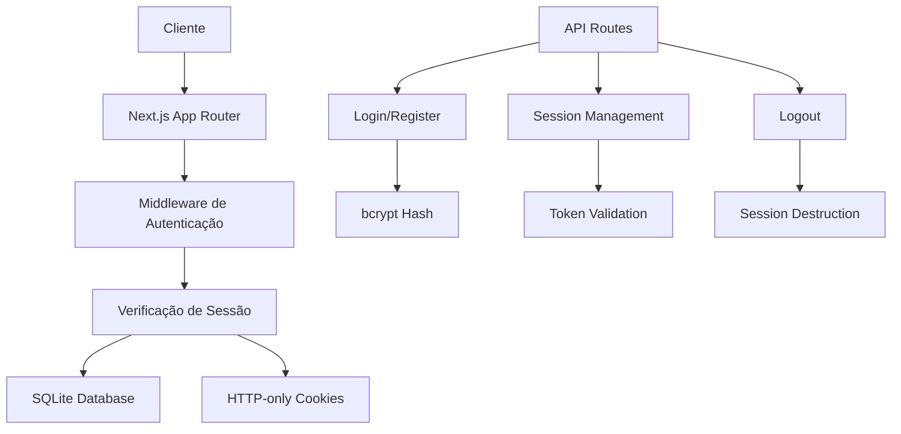

# 🔐 Sistema de Autenticação com Sessões

Um exemplo completo de implementação de autenticação baseada em sessões usando Next.js 15, SQLite e cookies HTTP-only.

## 📋 Índice

- [Visão Geral](#-visão-geral)
- [Tecnologias Utilizadas](#-tecnologias-utilizadas)
- [Arquitetura do Sistema](#-arquitetura-do-sistema)
- [Instalação e Configuração](#-instalação-e-configuração)
- [Como Funciona a Autenticação](#-como-funciona-a-autenticação)
- [Estrutura do Projeto](#-estrutura-do-projeto)
- [API Endpoints](#-api-endpoints)
- [Segurança Implementada](#-segurança-implementada)
- [Funcionalidades](#-funcionalidades)
- [Desenvolvimento](#-desenvolvimento)
- [Deploy](#-deploy)

## 🎯 Visão Geral

Este projeto demonstra como implementar um sistema robusto de autenticação baseado em sessões, incluindo:

- ✅ **Registro e Login** de usuários
- ✅ **Sessões seguras** com cookies HTTP-only
- ✅ **Controle de acesso** baseado em sessão
- ✅ **Gerenciamento administrativo** de sessões
- ✅ **Timezone brasileiro** para todas as operações
- ✅ **Interface moderna** e responsiva
- ✅ **Segurança avançada** contra ataques comuns

## 🛠 Tecnologias Utilizadas

### **Frontend**
- **Next.js 15** - Framework React com App Router
- **React 19** - Biblioteca de interface
- **TypeScript** - Tipagem estática
- **Tailwind CSS** - Framework de estilos
- **PostCSS** - Processamento de CSS

### **Backend**
- **Next.js API Routes** - Endpoints da API
- **SQLite** - Banco de dados local
- **better-sqlite3** - Driver SQLite otimizado

### **Segurança**
- **bcryptjs** - Hash de senhas
- **crypto** - Geração de tokens seguros
- **HTTP-only cookies** - Proteção contra XSS
- **HMAC** - Assinatura de tokens

## 🏗 Arquitetura do Sistema



## 🚀 Instalação e Configuração

### **Pré-requisitos**
- Node.js 18+ 
- npm, yarn, pnpm ou bun

### **1. Clone o repositório**
```bash
git clone <repository-url>
cd session-example-app
```

### **2. Instale as dependências**
```bash
npm install
# ou
yarn install
# ou
pnpm install
```

### **3. Configure as variáveis de ambiente**
Crie um arquivo `.env.local` na raiz do projeto:

```env
# Chave secreta para assinar tokens (use uma chave forte em produção)
SECRET_KEY=sua-chave-super-secreta-aqui

# Ambiente (development/production)
NODE_ENV=development
```

### **4. Execute o projeto**
```bash
npm run dev
# ou
yarn dev
# ou
pnpm dev
```

### **5. Acesse a aplicação**
Abra [http://localhost:3000](http://localhost:3000) no seu navegador.

## 🔐 Como Funciona a Autenticação

### **1. Fluxo de Registro**
```typescript
1. Usuário preenche formulário → /register
2. Senha é hasheada com bcrypt → hashPassword()
3. Usuário é salvo no SQLite → createUser()
4. Redirecionamento para login
```

### **2. Fluxo de Login**
```typescript
1. Usuário preenche credenciais → /login
2. Verificação de senha → verifyPassword()
3. Criação de sessão → createSession()
4. Cookie HTTP-only é definido
5. Redirecionamento para dashboard
```

### **3. Verificação de Sessão**
```typescript
1. Cookie é lido automaticamente
2. Token é validado no banco → getSessionUser()
3. Verificação de expiração
4. Retorno dos dados do usuário
```

### **4. Logout**
```typescript
1. Sessão é removida do banco → destroySession()
2. Cookie é limpo
3. Redirecionamento para login
```

## 📁 Estrutura do Projeto

```
src/
├── app/                          # App Router do Next.js
│   ├── (auth)/                   # Grupo de rotas de autenticação
│   │   ├── login/page.tsx        # Página de login
│   │   └── register/page.tsx     # Página de registro
│   ├── api/                      # API Routes
│   │   ├── login/route.ts        # Endpoint de login
│   │   ├── logout/route.ts       # Endpoint de logout
│   │   ├── register/route.ts     # Endpoint de registro
│   │   └── sessions/             # Gerenciamento de sessões
│   │       ├── route.ts          # Listar sessões
│   │       └── [sessionId]/route.ts # Deletar sessão
│   ├── session/page.tsx          # Página de gerenciamento
│   ├── page.tsx                  # Página principal
│   ├── layout.tsx                # Layout raiz
│   └── globals.css               # Estilos globais
├── components/                   # Componentes React
│   └── LogoutButton.tsx          # Botão de logout
└── lib/                         # Utilitários e configurações
    ├── auth.ts                  # Lógica de autenticação
    ├── db.ts                    # Configuração do banco
    └── date-utils.ts            # Utilitários de data
```

## 🔌 API Endpoints

### **Autenticação**
- `POST /api/login` - Autentica usuário
- `POST /api/register` - Registra novo usuário
- `POST /api/logout` - Destrói sessão atual

### **Gerenciamento de Sessões**
- `GET /api/sessions` - Lista sessões ativas
- `DELETE /api/sessions/[id]` - Remove sessão específica

### **Exemplo de Uso**

```typescript
// Login
const response = await fetch('/api/login', {
  method: 'POST',
  headers: { 'Content-Type': 'application/json' },
  body: JSON.stringify({ email: 'user@example.com', password: 'senha123' })
});

// Logout
await fetch('/api/logout', { method: 'POST' });

// Listar sessões
const sessions = await fetch('/api/sessions').then(res => res.json());
```

## 🛡 Segurança Implementada

### **1. Hash de Senhas**
```typescript
// bcrypt com salt automático
const hash = await bcrypt.hash(password, 10);
const isValid = await bcrypt.compare(password, hash);
```

### **2. Tokens Seguros**
```typescript
// Token HMAC assinado
const raw = crypto.randomBytes(32).toString("hex");
const hmac = crypto.createHmac("sha256", SECRET).update(raw).digest("hex");
const token = `${raw}.${hmac}`;
```

### **3. Cookies HTTP-Only**
```typescript
// Cookie inacessível via JavaScript
cookies().set({
  name: 'session',
  value: token,
  httpOnly: true,        // Proteção XSS
  sameSite: 'lax',       // Proteção CSRF
  secure: true,          // HTTPS em produção
  expires: new Date(expires)
});
```

### **4. Validação de Sessão**
```typescript
// Verificação automática de expiração
const user = await getSessionUser();
if (!user) {
  // Redireciona para login
}
```

## ✨ Funcionalidades

### **👤 Para Usuários**
- Registro de conta com validação
- Login seguro com hash de senha
- Dashboard personalizado
- Logout com limpeza completa de sessão

### **🔧 Para Administradores**
- Visualização de todas as sessões ativas
- Deletar sessões remotamente
- Controle de acesso por usuário
- Monitoramento em tempo real

### **🌍 Recursos Globais**
- Timezone brasileiro em todas as operações
- Interface responsiva e moderna
- Feedback visual para todas as ações
- Tratamento robusto de erros

## 🛠 Desenvolvimento

### **Scripts Disponíveis**
```bash
npm run dev      # Servidor de desenvolvimento
npm run build    # Build para produção
npm run start    # Servidor de produção
```

### **Banco de Dados**
O SQLite é criado automaticamente na primeira execução. As tabelas são:

```sql
-- Tabela de usuários
CREATE TABLE users (
  id INTEGER PRIMARY KEY AUTOINCREMENT,
  email TEXT UNIQUE NOT NULL,
  password_hash TEXT NOT NULL,
  created_at TEXT NOT NULL DEFAULT (datetime('now'))
);

-- Tabela de sessões
CREATE TABLE sessions (
  id TEXT PRIMARY KEY,
  user_id INTEGER NOT NULL,
  created_at TEXT NOT NULL DEFAULT (datetime('now')),
  expires_at TEXT NOT NULL,
  FOREIGN KEY (user_id) REFERENCES users(id) ON DELETE CASCADE
);
```

### **Configurações Importantes**

```typescript
// Duração da sessão (em segundos)
export const SESSION_TTL_SECONDS = 120; // 2 minutos para teste

// Nome do cookie
export const COOKIE_NAME = "session";

// Chave secreta (use variável de ambiente em produção)
export const SECRET = process.env.SECRET_KEY || "dev-secret-change-me";
```

## 🚀 Deploy

### **Vercel (Recomendado)**
```bash
# Instale a CLI da Vercel
npm i -g vercel

# Deploy
vercel

# Configure as variáveis de ambiente
vercel env add SECRET_KEY
```

### **Outras Plataformas**
- **Railway**: Suporte nativo ao Next.js
- **Netlify**: Funciona com adapters
- **Docker**: Use a imagem oficial do Node.js

### **Variáveis de Ambiente para Produção**
```env
SECRET_KEY=chave-super-secreta-de-producao
NODE_ENV=production
```

## 🔍 Exemplos de Uso

### **Verificar Autenticação**
```typescript
// Em qualquer página
const user = await getSessionUser();
if (!user) {
  redirect('/login');
}
```

### **Criar Nova Sessão**
```typescript
// Após login bem-sucedido
const token = await createSession(userId);
```

### **Destruir Sessão**
```typescript
// No logout
await destroySession();
```

## 📚 Recursos Adicionais

- [Next.js Documentation](https://nextjs.org/docs)
- [SQLite Documentation](https://www.sqlite.org/docs.html)
- [bcrypt.js Documentation](https://github.com/dcodeIO/bcrypt.js)
- [HTTP-Only Cookies Security](https://owasp.org/www-community/controls/SecureCookieAttribute)

## 🤝 Contribuição

1. Fork o projeto
2. Crie uma branch para sua feature (`git checkout -b feature/AmazingFeature`)
3. Commit suas mudanças (`git commit -m 'Add some AmazingFeature'`)
4. Push para a branch (`git push origin feature/AmazingFeature`)
5. Abra um Pull Request

## 📄 Licença

Este projeto está sob a licença MIT. Veja o arquivo `LICENSE` para mais detalhes.

---

**Desenvolvido com ❤️ para demonstrar autenticação segura com sessões**